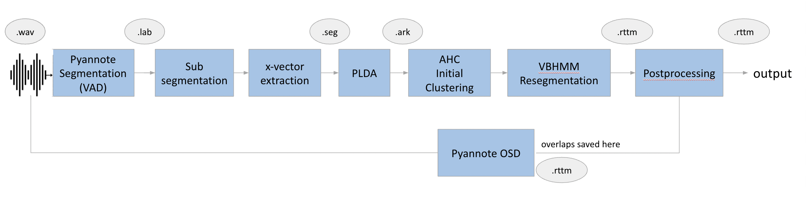

## A Speaker Diarization pipeline

<p align="center"></p>

### INSTRUCTIONS FOR INFERENCING

```
- pip install -r requirements_pip.txt   conda create --name <env> --file <this file>
- cd VBx
- python predict.py --in-wav-path "YOUR_AUDIO_WAV_FILE_PATH"
```

OR for conda environment

```
- conda create --name vbx_env --file <this file>
- conda activate vbx_env
- cd VBx
- python predict.py --in-wav-path "YOUR_AUDIO_WAV_FILE_PATH"
```

# files

## `PyannoteVAD.py`

This file computes voice activity detection (VAD) on a `.lab` file.

## `generate_embeddings.py`

This file subsegments the audio and computes the x-vectors and also performs PLDA and saves them in a `.seg` file and `.ark` file.

## `vbhmm.py`

This file performs resegmentation of the generated x-vectors as per VB-HMM mathematical model. It saves result in a `.rttm` file in `exp/rttm` folder".

## `PyannoteOSDv1.py`

This file performs overlap speech detection on the audio files. It saves the overlap regions in a `.rttm` file inside `exp/overlap`. It also postprocesses the generated rttm to incorporate overlap regions and saves the updated `.rttm` file in `exp/rttm_osd`

## `predict.py`

This file incorporates the entire pipeline

**Input Arguments:**

- **`token`**: Hugging Face token for accessing the pyannote segmentation 3.0 repository. Note that you need to request access to the VAD model API, as it is gated. [Request access here](https://huggingface.co/pyannote/segmentation-3.0).
- **`path`**: The path where the VAD output file will be saved in `.lab` format.
- **`wav_path`**: The path to the file or folder containing `.wav` files to be processed.
- **`config`**: A dictionary containing custom-defined parameters.

---

More details about the full recipe in\
F. Landini, J. Profant, M. Diez, L. Burget: [Bayesian HMM clustering of x-vector sequences (VBx) in speaker diarization: theory, implementation and analysis on standard tasks](https://www.sciencedirect.com/science/article/pii/S0885230821000619)

If you are interested in the original version of VBx (prepared for the Second DIHARD Challenge), please refer to the [corresponding branch](https://github.com/BUTSpeechFIT/VBx/tree/v1.0_DIHARDII).\
If you are interested in the VBx recipe prepared for the track 4 of VoxSRC-20 Challenge (on VoxConverse), please refer to the [corresponding branch](https://github.com/BUTSpeechFIT/VBx/tree/v1.1_VoxConverse2020).

## Citations

In case of using the software please cite:\
F. Landini, J. Profant, M. Diez, L. Burget: [Bayesian HMM clustering of x-vector sequences (VBx) in speaker diarization: theory, implementation and analysis on standard tasks](https://www.sciencedirect.com/science/article/pii/S0885230821000619) [(arXiv version)](https://arxiv.org/abs/2012.14952)

```
@article{landini2022bayesian,
  title={Bayesian HMM clustering of x-vector sequences (VBx) in speaker diarization: theory, implementation and analysis on standard tasks},
  author={Landini, Federico and Profant, J{\'a}n and Diez, Mireia and Burget, Luk{\'a}{\v{s}}},
  journal={Computer Speech \& Language},
  volume={71},
  pages={101254},
  year={2022},
  publisher={Elsevier}
}

@inproceedings{Bredin23,
  author={Hervé Bredin},
  title={{pyannote.audio 2.1 speaker diarization pipeline: principle, benchmark, and recipe}},
  year=2023,
  booktitle={Proc. INTERSPEECH 2023},
}
```
